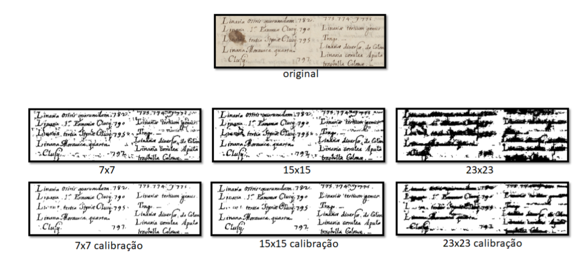

# Binarização de Documentos Históricos Usando Redes Neurais Convolucionais

Projeto da disciplina de Visão Computacional da pós-graduação em Ciência de Dados - Unibratec - 2019.

Autores: Julio Sales e Victor Outtes.

A proposta deste trabalho é aplicar uma solução baseada no trabalho de Dan Ciresan et al., onde os autores utilizaram 
redes neurais convolucionais para segmentar membranas de neurônios em imagens de microscópio eletrônico. 
Propusemos aplicar uma variação do trabalho de Dan para binarizar documentos históricos, com bons resultados 
preliminares.

### Como rodar

1) Clone o projeto.
2) Crie um virtual env: `python3 -m venv venv`, depois ative. (opcional)
3) Instale os requisitos com o comando `pip install -r requirements.txt`
4) Execute qualquer um dos arquivos `arquitetura_7x7.py`, `arquitetura_15x15.py` ou
`arquitetura_23x23.py` 

### Exemplo de resultado

